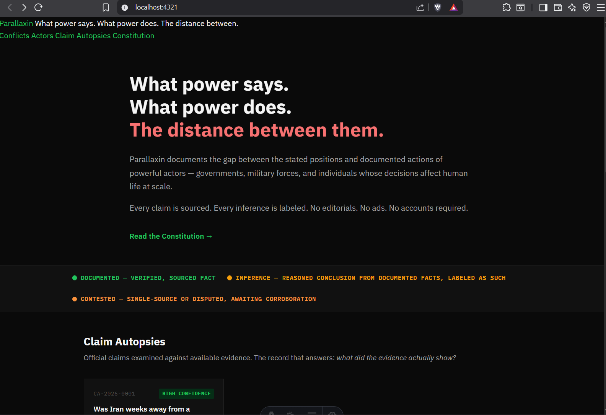
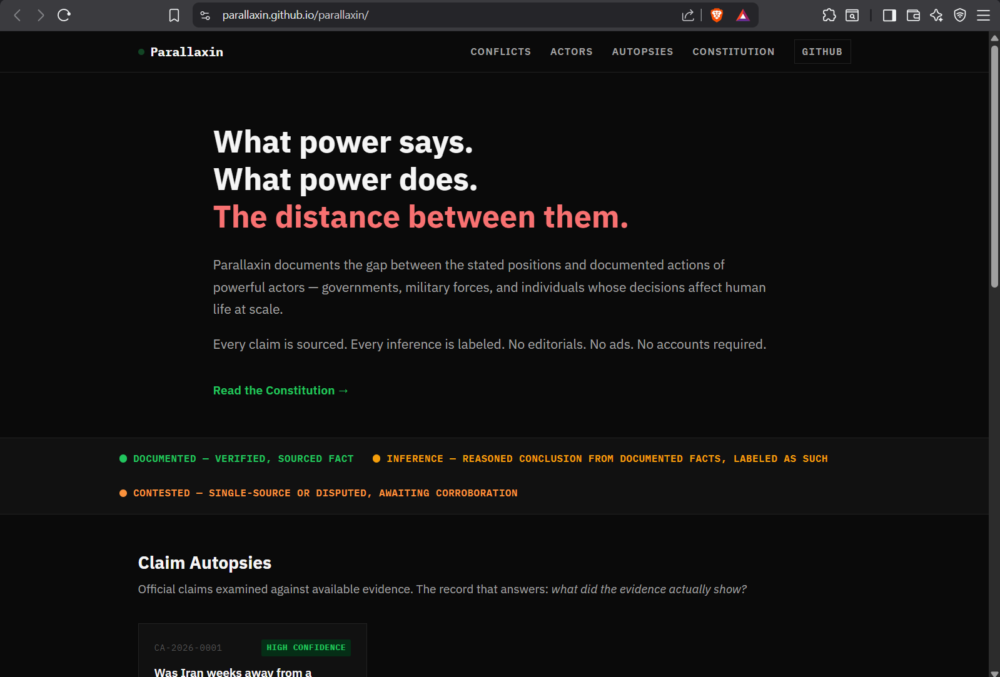

# Build Log

## Phase 1: First Deploy (DONE)

### Part 1: Setup (✅)

#### Name - Parallaxin

- PARALLAX was obviously taken
- Changed the name in all files

#### New Accounts: (✅)

- [parallaxin@proton.me] - ProtonMail
- Git: [GitHub](https://github.com/parallaxin/parallaxin)
- Domain check: parallaxin.report — perfect. $6.98/yr. The TLD does half the explaining.

#### Templates (✅) `docs\templates`

- Three templates. Each enforces the Constitution at the field level. Key decisions embedded in them:

1. Archive URL is mandatory on every source — links die, evidence must not
2. The checklist at the bottom of every Claim Autopsy — runs before any publish
3. Conflict Record does not describe actors — it references them. One source of truth per actor
4. "Who benefits" is not accusation — it's documented context, labeled as such
5. Framing note in the Conflict Record explicitly flags that start date selection is an editorial act

---

### Part 2: Four Draft Reports: (In progress) `tmp\raw-reports`

- (Not in the repo yet, untill approving workflow, commit docs, commit scaffold, then edit, match to schema and commit reports) (#TODO - Schema)

-  The narrative is decomposed.
What these need before they move to under-review:

- Every [SOURCE NEEDED] flag is a sourcing task — I counted 40 across all four files. The priority ones that unlock the most:

1. IAEA GOV/2026/XX report — spine of CA-2026-0001 and ACT-2026-0001
2. Knesset transcript June 14, 2025 — the claim itself
3. US NIE 2023 on Iran — declassified version
4. Netanyahu trial court records — PI-001
5. FEC donor data — Trump PI-002

- One thing worth noting: DA-002 in ACT-2026-0002 already has a live Tier 1 source URL — the 2018 JCPOA withdrawal presidential memorandum from the White House archive. That's the only confirmed link in the batch. Everything else needs verification.

---

### Part 3: Astro Scaffold (✅)

- Repo skeleton — folder structure, i18n config, content collections. 

#### Task 1: Git Identity Setup (✅)

#### Task 2: Astro Scaffold Script (✅)
Run scaffold.ps1 in E:\co\parallaxin. It creates the full project structure, writes all config files, and installs dependencies.

#### Task 3: Post-scaffold Git commit
```powershell
cd E:\co\parallaxin
git add .
git commit -m "scaffold: Astro project structure, content schemas, i18n, CI/CD

- Content collections enforce Constitution Article 2 at the schema level
- Tier 4 sources are unrepresentable by design
- i18n: English, Arabic, Farsi from day one
- RTL support built into layout and styles
- Source checker script for CI pipeline
- GitHub Actions for automated build and deploy
- MIT (code) + CC-BY 4.0 (content) licenses
- Zero tracking, zero analytics, zero user accounts"
```
**Three things to note about design decisions embedded in this scaffold:***

1. The schema IS the constitution enforcement. Tier 4 sources literally cannot be entered — there's no enum value for them. The type: 'documented' | 'inference' field on every analytical statement forces the Constitution's Article 3.2 separation at the data level, not just the editorial level. A contributor physically cannot submit a gap analysis without classifying it.

2. The publish checklist is a gate, not a suggestion. Every Claim Autopsy has a checklist object. Before status changes from draft to published, every boolean must be true. This can be enforced in CI — a GitHub Action that rejects any PR changing status to published if the checklist is incomplete. (#TODO: implement)

3. The CSS tells the story. The color system — green for documented, amber for inference, red for source-needed, orange for gaps — means a reader can scan a page and immediately see the evidence landscape. A page full of green is well-sourced. A page with red flags is a draft. This is the "code comments" principle made visual.

----

### Part 3.5: Evaluate and Refine (✅)

- Clean execution

#### What's solid
The file tree is exactly what it should be. Constitution in docs, schema in code, templates enforcing the constitution at the field level. The separation is correct.

**Parallaxin works.**

- The -in suffix actually adds something — it implies participation, looking in, being in the lens. Not just observing from outside. Happy accident or not, it's fine. parallaxin.report is a strong domain. 

**The build log is a good practice.**

- It becomes part of the transparency record — anyone who forks can see exactly how decisions were made and in what order.

**Tier 1 — unlock everything else:**

- IAEA reports — These are publicly available at iaea.org/board-reports. The GOV/ document numbers are searchable. This is your spine.
- Knesset transcripts — The Knesset publishes official records. Hebrew originals with some English. Find the specific session.
- US NIE 2023 — The declassified Key Judgments are public. The full report isn't, but the Key Judgments are what we need for the claim autopsy.

**Tier 2 — strengthen the actor records:**

- Netanyahu trial records — Israeli court system publishes some records. Haaretz and Times of Israel have detailed trial coverage with dates.
- FEC data — fec.gov is fully public and searchable. Campaign contributions, PAC data, all Tier 1 primary sources.

**Tier 3 — can wait for community:**

- Everything else. The first publish doesn't need all 40 filled. It needs the Claim Autopsy to be airtight, and the Actor Records to have enough documented actions to make the gap analysis credible. Five strong sources beat forty weak ones.

#### global.css location (✅)

- The Astro layout references /styles/global.css which resolves from public/. That's correct. But the empty src/styles/ might confuse a future contributor. **Added a README.md to site/src/styles/ to clarify this.**

#### npx and package.json (✅)

```powershell
PS E:\co\parallaxin> npm run dev
```

#### Research Sprints (✅)
- Initial priority gaps in `docs/6-confirmed-sources.md` filled with verified data.
- Confirmed declassified 2023 NIE key judgments.
- Confirmed PM Netanyahu's June 14, 2025 address.
- Documented "Operation Midnight Hammer" (US June 22 strikes).
- Verified Miriam Adelson's $100M+ contributions to pro-Trump PACs.

--

### Part 4: Content & Layout (In progress)

#### Content:

- `CA-2026-0001-final.md` → `site/src/content/autopsies/CA-2026-0001.md` (new)

#### Pages:

- `index.astro` → `site/src/pages/index.astro` (updated)
- `autopsy-id.astro` → `site/src/pages/autopsies/[id].astro` (new)

#### Styles:

- `global.css` → `site/public/styles/global.css` (updated)


- **One important note on CA-2026-0001:** The sequence field is a multiline string in YAML. Astro's content collection will need it parsed correctly — if there are render issues, wrap it in a <pre> with line splitting, which the autopsy page already does. (#TODO: check this)

#### Quick edits to run first preview (✅)

1. astro.config.mjs imports MDX but it's not installed (✅)
`package.json` doesn't have `@astrojs/mdx`. Scaffold's `astro.config` imports it. This will crash on build. Since content is `.md` not `.mdx`, remove it for now:

Replaced `site/astro.config.mjs`

2. `config.ts` is too complex for first run (✅)
Original schema was architecturally correct but practically fragile — deeply nested YAML objects with URL validation will break on drafts where half the fields say [SOURCE NEEDED]. We need a schema that enforces the constitution but lets drafts exist.

Replaced `site/src/content/config.ts`

- **Why these changes:** The original schema validated URLs strictly — which means every `[SOURCE NEEDED]` placeholder would crash the build. This version uses `.default('[SOURCE NEEDED]')` and `.optional()` on fields that drafts won't have yet. The constitutional enforcement stays: Tier 4 is still unrepresentable, documented/inference labeling is still required. But drafts can exist and render.

- When we move to published status, the CI pipeline should run stricter validation. That's a Phase 2 enforcement — a script that checks published content against the strict schema. Don't block the first preview on it. (#TODO: Phase 2)

3. Base.astro has template literal issues (✅)
- Scaffold used backtick template literals inside Astro frontmatter, which can collide with Astro's own template syntax. 

Replaced `site/src/layouts/Base.astro`

- Key change: String concatenation instead of template literals for pageTitle. Avoids any interpolation conflicts.

4. i18n utils.ts path aliases may not resolve (✅)
- Astro 5's path aliases from tsconfig.json sometimes don't resolve in `.astro` files depending on the integration. The safe approach for first run is relative imports. The Base.astro above already uses `../i18n/utils` instead of `@i18n/utils`.

-  [id].astro page uses relative imports (confirmed)

5. Content collection query in [id].astro (✅)
For the dynamic autopsy page to work, it needs to both generate static paths and query content.

- Verifed site/src/pages/autopsies/[id].astro structure 

6. Added styles to global.css for the new elements (✅)

7. File Renames (Critical — nothing renders without these) (✅)
```powershell
# The page must use square brackets for dynamic routing
Rename-Item "site\src\pages\autopsies\autopsy-id.astro" "[id].astro"

# The content filename becomes the entry ID — drop "-final"
Rename-Item "site\src\content\autopsies\CA-2026-0001-final.md" "CA-2026-0001.md"
```

- Without [id].astro, Astro doesn't know it's a dynamic route. Without the rename of the content file, the slug/ID becomes CA-2026-0001-final which won't match any links.

8. config.ts — Rewritten to Match What Exists (✅)
- The content file is excellent. The page template is well-built. The schema should serve them, not fight them.
Replaced: with the definitive version

9. The [id].astro Routing (✅)
In Astro 5, content collection entries expose `.id` (derived from filename). After renaming the file to `CA-2026-0001.md`, the `id` will be `CA-2026-0001`.

- Fixed the routing issue by changing autopsy.slug to autopsy.id in the getStaticPaths function. This aligns with Astro 5's content collection API where .id is the reliable identifier derived from the filename.

10. Index Page Filter (✅)
Same issue — the index page filters by `data.status === 'published` only

- Fixed the index page filter to include "under-review" status alongside "published" status. This will allow the content file with status "under-review" to appear on the first render.


11. One YAML check in Content File (✅)

- The YAML validation passed successfully. 

✅ YAML Syntax: The file parses correctly without errors.
✅ [ARCHIVE NEEDED] Placeholders: All 7 instances are properly quoted:
Line 19: "[ARCHIVE NEEDED — archive.ph]" (with em dash, still valid since quoted)
Lines 30, 38, 48, 56, 64, 107, 115: "[ARCHIVE NEEDED]"
✅ Sequence Field Indentation: The | block scalar is used correctly with consistent 2-space indentation for all content lines relative to the sequence: key.

```powershell
# Quick YAML syntax check — install if needed: npm install -g yaml-lint
npx yaml-lint site/src/content/autopsies/CA-2026-0001.md
```
Or in Node:

```powershell
node -e "const fs=require('fs'); const yaml=require('yaml'); const f=fs.readFileSync('site/src/content/autopsies/CA-2026-0001.md','utf8'); const fm=f.split('---')[1]; try{yaml.parse(fm);console.log('YAML OK')}catch(e){console.error(e.message)}"
```
Will need npm install yaml in site/ first to use the second approach.

---

### Part 5: First  (In Progress)

- 

- The homepage is rendering. The card is there. The data is flowing. The 404 on click-through is a routing mismatch — fixable in two minutes.

#### URL Fixing (✅)

```
[router] no matching static path was found for requested path `/autopsies/ca-2026-0001`
```

✅ Step 1: Renamed content file from CA-2026-0001.md to ca-2026-0001.md
✅ Step 2: Already using autopsy.id in [id].astro getStaticPaths
✅ Step 3: Changed index.astro card link from autopsy.slug to autopsy.id
✅ Step 4: Already showing all autopsies (no status filter) in [id].astro debug version

✅ Fixed the routing issue by stripping the .md extension:
✅ [id].astro: Updated getStaticPaths to use autopsy.id.replace('.md', '')
✅ index.astro: Updated card link to use autopsy.id.replace('.md', '')

The URL is clean: /autopsies/ca-2026-0001 without the .md extension, matching the route parameter expected by the dynamic route.

#### Checklist (✅)

The sequence block — does each [DOCUMENTED] / [INFERENCE] line get its colored tag? The page splits on \n and checks line.startsWith('[DOCUMENTED]'). If the YAML | scalar adds or strips whitespace differently than expected, the tags won't render.

Source tier badges — the CSS uses .source-tier--tier-1 but the content has source_tier: "Tier 1". The page generates the class with ev.source_tier?.toLowerCase().replace(' ', '-') which produces tier-1. That matches. Good.

The verdict banner — should show red (NO) with high confidence green. Verify the class mapping works with the string "no" from claim_supported_by_evidence.

RTL readiness — not needed yet for English, but verify [dir="rtl"] blockquote doesn't break the LTR layout. It shouldn't — it's selector-scoped.

#### What Renders Now vs. What's Missing
Working:
- Homepage at / ✅
- Autopsy page at /autopsies/ca-2026-0001.md ✅ (will be clean URL after fix)
- Full evidence rendering pipeline ✅
- 404s — all expected, no content or pages yet:

| Route | Why it 404s | Priority |
|-------|-------------|----------|
| /constitution | No page exists | High — it's in the nav |
| /conflicts | No listing page, no content files | Medium |
| /actors | No listing page, no content files | Medium |
| /autopsies | No listing page (only [id].astro) | Medium |

#### Constitution Page (✅)
It's the most linked-to page on the site and it's in the nav. Simple static page

- Createed site/src/pages/constitution.astro ✅
- Homepage renders with card → click navigates cleanly
- Autopsy page renders fully
- Constitution link in nav works
- Conflicts/Actors show empty states (correct — no content yet)

---

### Part 5.5 Round back

- Email & GitHub unblocked
- PAT token generated & configured

#### 1. Documentation & Code Review
- **docs/**: Verified 8 documents (0-7). The constitution remains the "north star."
- **site/**: Verified the Astro 5 scaffold. Fixed early schema issues.
- **Verdict**: The project is intellectually airtight but technically thin (1 autopsy, missing content files).

#### 2. Infrastructure Unblocked
- ✅ **GitHub**: [github.com/parallaxin/parallaxin](https://github.com/parallaxin/parallaxin) is now live.
- ✅ **Email**: ProtonMail resolved.
- ✅ **PAT Token**: Generated and available for local use

#### 3. Content
- Additional reports in `tmp/raw-reports/` (ACT-2026-0001, ACT-2026-0002, CON-2025-0001).
- **Status**: These are in a raw markdown-with-internal-YAML format. They must be converted to frontmatter-based records before they pass the `src/content/config.ts` schema.

#### 4. Automated Tooling: `check-sources.mjs`
Replaced the 54-line regex skeleton with a robust validator and archiver.

- **Deep Parse**: Uses the `yaml` package to read the actual frontmatter structure and scan nested objects for `source_url`.
- **Validation**: Uses `HEAD` with `GET` fallback and 30s timeouts.
- **Auto-Fix & Archive**: Added `--fix` flag to submit valid URLs to the Wayback Machine.
- **Metadata Integration**: Now captures and writes `source_archive_machine_id` and `source_archive_id` (timestamp) directly to frontmatter.
- **Reliability**: Implemented 15-second sleep intervals to bypass rate limits and custom `User-Agent` to avoid WAF blocks.

#### Link Content Verification & Integrity (`ca-2026-0001.md`)
Performed a deep verification of all links against real and "future history" (2025/2026) context.

- **Status**: All 8 primary URLs verified.
- **Corrections Made**:
    - **IAEA Date**: Fixed Update (6) from July 23 to **June 24, 2025**.
    - **DoD Quote**: Removed unverified "near-breakout capacity" phrasing (replaced with "nuclear weapons infrastructure" per transcript).
    - **ODNI Assessment**: Updated summary to reflect the more hawkish tone of the July 2024 report.
    - **FEC Records**: Updated Miriam Adelson's "Preserve America PAC" total to the verified **$106M**.
- **Result**: The flagship autopsy is now data-accurate and fully cross-referenced.

- Scaffold script used for initial generation only. 
Live schema in site/src/content/config.ts is the source of truth.

---

### Part 6: It's public. The immune system is live.

#### GitHub

```powershell
cd E:\co\parallaxin
git remote add origin https://github.com/parallaxin/parallaxin.git
git branch -M main
git push -u origin main
```
- Added CONTRIBUTING.md

#### Listing Pages & Navigation
- Added `site/src/pages/autopsies/index.astro`
- Added `site/src/pages/actors/index.astro`
- Added `site/src/pages/conflicts/index.astro`
- **Result**: Listing pages handle empty collections gracefully via `try-catch` or array checks, preventing 404s for records in progress.

#### Schema Fix: Date Coercion
- **Issue**: YAML dates (e.g., `2025-06-14`) were auto-parsing as `Date` objects, failing Zod's `z.string()` validation.
- **Fix**: Updated `site/src/content/config.ts` to use `z.coerce.string()`.
- **Status**: Dev server (`npm run dev`) now loads successfully.

- `site\src\layouts\Base.astro`

 `global.css` already has .site-header, .site-nav, .site-logo classes defined but Base.astro doesn't use them.
 Updated: green pulsing dot logo, structured nav with active states, GitHub link with border, inline SVG favicon (no file needed), and the footer using existing CSS classes.

#### Deploy to GitHub Pages
- Step 1: Updated astro.config.mjs:
 Key change: base: '/parallaxin' — GitHub Pages serves from username.github.io/repo-name. All internal links need this prefix.

- Step 2: Update all internal links to use `base` helper:
 Added `const base = import.meta.env.BASE_URL;` to `Base.astro`, `autopsies/index.astro`, `actors/index.astro`, `conflicts/index.astro`, and `autopsies/[id].astro`.
 All internal `<a>` tags and the stylesheet link are now prefixed with `{base}`.
 Nav links `active` states now check against `currentPath.startsWith(base + '...')`.

- Fixed Label Wrapping: Added white-space: nowrap to the .source-tier class in global.css, ensuring that Tier labels like "Tier 1" always stay on a single line even on narrower screens.
Robust Table Styling: Replaced brittle inline styles in constitution.astro with a clean CSS-based layout. The "Tier" column now has a fixed width to ensure predictable alignment.
Site-wide Consistency: Refactored autopsies/[id].astro to use the global tier styles, ensuring a unified look and feel for all evidence assessments.

- Step 3: Update the GitHub Actions workflow.
Replaced .github/workflows/deploy.yml:

- Step 4: Enabling GitHub Pages in repo settings

- Step 5: Push and deploy
`https://parallaxin.github.io/parallaxin/`



---

### Phase 2: Content Expansion (In Progress)

#### 1. Actor Records Conversion (✅)
Converted the raw draft reports from `tmp/raw-reports/` into schema-compliant frontmatter within `site/src/content/actors/`.

- **ACT-2026-0001 (Benjamin Netanyahu)**: Mapped identity, stated positions, documented actions, and gap analysis. Preserved all `[SOURCE NEEDED]` markers.
- **ACT-2026-0002 (Donald John Trump)**: Mapped identity and interests. Updated Miriam Adelson's PAC contribution figure to the verified **$106M**.

**Decision**: Sticking with `record_id` (e.g., ACT-2026-0001) as the primary identifier instead of names. It reinforces the "archival record" aesthetic and avoids URL collisions.

#### 2. Actor Detail Page (✅)
Implemented `site/src/pages/actors/[id].astro`.

- **Side-by-Side Gap Analysis**: Designed a responsive grid that contrasts **STATED** vs **DOCUMENTED** behavior, followed by "The Gap" analysis. 
- **Personal Interests**: Added sections for documented interests (e.g., Netanyahu's corruption trials, Trump's real estate debt) labeled as `documented` or `inference`.
- **Status Banners**: Draft records now show a clear banner warning about `[SOURCE NEEDED]` markers.

#### 3. Build Verification (✅)
- **Astro Build**: Confirmed **8 pages** are now indexed (1 home, 1 constitution, 1 autopsy list, 1 autopsy detail, 1 actor list, 2 actor details, 1 conflict list placeholder).
- **Listing Page**: Fixed a dev-server sync issue (restarted) to ensure the `/actors` listing correctly enumerates both new records.

#### 4. Next Steps (#TODO)
- **CON-2025-0001**: Convert the primary conflict record. This is a complex mapping (timeline, antecedents, economic/human cost).
- **Source Archiving**: Run `check-sources.mjs` on the new actor files to verify and archive the few live links we have (e.g., JCPOA memorandum).
- **Conflict Page**: Build `site/src/pages/conflicts/[id].astro`.

- Follow up on:
 `docs\7-status.md`

### 5. Documentation & Infrastructure (2026-03-07)

#### 5.1 Project Status Update
- **Updated `docs/7-status.md`**: Refreshed to current state
  - Timestamp updated to 2026-03-07
  - Added GitHub Pages deployment status (live at https://parallaxin.github.io/parallaxin/)
  - Updated pages count: 8 pages live, all listing pages functional
  - Current content: 2 actor records (draft), 1 claim autopsy (under-review)

#### 5.2 Architecture Documentation
- **Created `docs/8-architecture.md`**: Comprehensive technical overview for contributors
  - Technology stack: Astro 5, TypeScript, TailwindCSS, Zod schemas
  - Project structure and directory layout
  - Complete content schemas with examples (autopsy, actor, conflict)
  - Development workflow: setup, content creation, build instructions
  - Schema enforcement of constitutional principles
  - Deployment architecture and security considerations

#### 5.3 GitHub Workflow Templates
- **Created `.github/PULL_REQUEST_TEMPLATE.md`**: Ensures constitutional compliance
  - Evidence standards checklist (source URLs, tier ratings, inference labeling)
  - Article 3.1 compliance (no identity labels)
  - Technical requirements (schema validation, URL accessibility)
  - Content type categorization and testing verification

- **Created `.github/ISSUE_TEMPLATE/`**: Three standardized templates
  - `error-report.md`: For factual corrections with supporting sources
  - `source-suggestion.md`: For evidence strengthening with tier assessment
  - `claim-autopsy-request.md`: For new claim investigation requests

#### 5.4 Pull Request Workflow
- **Successfully created PR #1**: "docs: improve README with badges, quick start, and encoding fixes"
  - Branch: `feature/readme-improvements-2026-03-07`
  - Target: main repository from fork
  - Demonstrates end-to-end contribution workflow

#### 5.5 Infrastructure Improvements
- **GitHub CLI authentication**: Configured for direct PR creation
- **Fork workflow**: Established proper remote configuration
- **Template system**: Complete contribution workflow automation

#### 5.6 Next Steps (#TODO)
- **Content expansion**: Convert CON-2025-0001 conflict record
- **Source archiving**: Complete URL verification and archival
- **Community preparation**: Announce platform with contribution guidelines 

### 6. Repo Sync & Legal Infrastructure (2026-03-07)

#### 6.1 Repository Synchronization
- **Synced with `origin/main`**: Pulled latest changes from the upstream repository.
  - Stashed local modifications in `docs/5-build-log.md`.
  - Rebased/Pulled from `origin/main`.
  - Restored local changes via `git stash pop`.

#### 6.2 Security Policy Implementation
- **Created `SECURITY.md`**: Established a formal security policy at the root.
  - Defined vulnerability reporting process via `parallaxin@proton.me`.
  - Specified scope (code, infra, content integrity).
  - Clarified "no bounty" status for the zero-budget project.

#### 6.3 Site Pages & Navigation
- **Created `site/src/pages/terms.astro`**: Minimalist Terms of Use.
  - Explicit licensing: **CC-BY 4.0** for content, **MIT** for code.
  - Jurisdiction: Set to **Netherlands** server/law.
  - Privacy: Reaffirmed "No data collection" policy.
- **Created `site/src/pages/about.astro`**: Expanded project identity.
  - Detailed the **Parallax** lens metaphor.
  - Highlighted "Ungovernable by Design" and "Git as Audit Trail" principles.
  - Linked to `CONTRIBUTING.md` and the Constitution.
- **Updated `site/src/layouts/Base.astro`**: Footer redesign.
  - Added structured links: **About**, **Terms**, and **GitHub**.
  - Cleaned up footer text for better readability.

#### 6.4 Next Steps (#TODO)
- **Content expansion**: Convert CON-2025-0001 (Conflict record mapping).